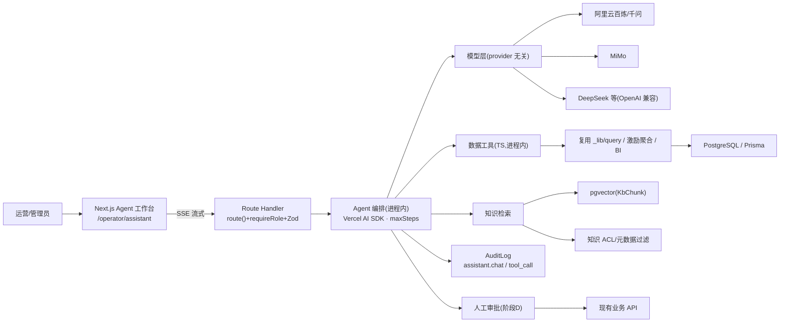

# 中台 AI Agent 与知识库建设方案(定稿 · 阶段 10)

> 状态:方向已定稿,尚未实现。关键决策见 §1,已锁定。
> 目标:在现有中台内建设一个**能读项目数据、能查知识库、能被审计的运营 Agent**,而非"会查库的聊天框"。
> 本文是设计定稿。§0–§15 为方案主体;**实现级细化(工具签名 / 路由骨架 / RAG 检索 SQL / 完整数据模型 / 系统提示词 / 一次问答时序 / SSE 协议 / 10.1 任务清单 / 压测方案)见 §16 附录 B**。落地按 §14 分阶段推进,每阶段可独立上线。

---

## 0. 结论(定稿)

**Agent 主循环放在 Next.js 进程内(Node runtime),用 provider 无关的 Vercel AI SDK 驱动,默认对接国产模型(百炼/MiMo/DeepSeek 等 OpenAI 兼容端点);数据通过复用现有查询逻辑封装的「只读工具」访问,知识库用 PostgreSQL + `pgvector` 做 RAG;权限、审批、审计全部留在中台。**

- 业务权限主体始终是中台(RBAC/审批/审计),模型只在受控工具边界内取数。
- 结构化业务数据走工具查询,文档制度走知识库检索,**结构化数据不进向量库**。
- 有副作用的操作必须人工审批后,仍调用现有业务 API 并写 `AuditLog`。
- 模型供应商可替换,业务工具不绑定任何模型厂商。

本方案在与另一份"独立 Python LangGraph Runtime"方案对比后收敛而来,吸收了其治理设计(证据结构、知识 ACL、文档生命周期、三层记忆、评测黄金集),但结合本项目规模与两项决策(§1)选择了更克制的进程内路线。对比说明见 §15。

---

## 1. 已锁定的关键决策

| # | 决策 | 结论 | 影响 |
|---|---|---|---|
| 1 | **数据出境合规** | 运营数据**不得出境**;后续大概率用国产模型(MiMo、阿里百炼等) | 排除 Anthropic/OpenAI 海外 API;模型层走**国产 + provider 无关**;不能用 Anthropic SDK 的 tool_runner |
| 2 | **data-hub Python 分析服务** | **维持现状**,不做大成统一 AI 平台 | Agent 编排放**中台进程内**,不新起独立 Runtime / Redis / Tool 网关;LangGraph 推迟到阶段 D 再评估 |
| 3 | Agent 运行时位置 | 进程内 TS(由决策 2 推导) | 工具直接复用中台查询逻辑,零跨服务跳与跨服务鉴权 |
| 4 | Agent 框架 | **Vercel AI SDK**(`ai` + `@ai-sdk/openai-compatible`) | provider 无关、原生 Next.js 流式、`maxSteps/stopWhen` 支撑多轮工具循环 |

**仍需在实现前验证(非阻塞决策,是压测项):**
- **国产模型的 function-calling 稳定性**——见 §4 与 §13,列为阶段 10.1 验收项。
- **嵌入模型**:百炼 `text-embedding` 端点 vs 自托管 bge-m3——见 §6,定稿默认自托管/国产,不出境。

---

## 2. 需求:三层能力

| 层 | 说明 | 示例 |
|---|---|---|
| **A. 对话** | 自然语言问答、生成周报草稿、解释指标 | "解释一下这条激励是怎么算出来的" |
| **B. 数据 Agent** | Agent 自主拆解问题 → 选工具取数 → 计算对比 → 带依据作答 | "上月 3 团涨粉 Top5 是谁""A 活动激励预估总额多少""哪些爬虫任务最近失败多" |
| **C. 知识库(RAG)** | 检索增强问答,答案带出处 | "本活动投稿规范怎么写""历史某活动复盘结论" |

**B 层铁律:禁止 text-to-SQL / 禁止模型生成任意查询。** 只暴露签名明确、Zod 校验入参、内部走 `prisma` 白名单的**只读语义工具**(curated tools / semantic layer)。这是大厂 BI Copilot 的通用教训:让模型直连库既绕过 RBAC/口径,又是注入与泄露的重灾区。

---

## 3. 总体架构



**为什么进程内 TS 是本项目的正解:**
- 取数逻辑、口径、权限**已经全部沉淀在 TS/Prisma**(主播名单 `LEFT JOIN` 聚合、`hidden=false` 排除、UTC→上海时区、激励候选=报名∪投稿)。工具直接调这份代码,口径零漂移、无网络跳、无跨服务鉴权。
- 决策 2 已确认不把 Python 服务做大,故不引入独立 Runtime——避免"为解耦而新建 Tool 网关 + 跨服务鉴权"这类隐性成本。

可复用的现有基础:
- 数据权限入口:`lib/rbac.ts`(`requireRole`)
- 统一审计:`lib/audit.ts` + `AuditLog` 模型
- 密钥加密:`lib/crypto.ts`(AES-256-GCM)
- LLM 配置雏形:`prisma/schema.prisma` 的 `OpinionSettings`(将泛化为 `AiModelProfile`)
- 现有查询聚合:主播 `app/operator/data/streamers/_lib/query.ts`、激励 `lib/incentive/aggregate.ts`、BI 页聚合

---

## 4. 模型层(国产 · provider 无关)

**不使用 Anthropic SDK**(数据不出境,且其 tool_runner 为专用)。改用 **Vercel AI SDK**,对接**国产模型的 OpenAI 兼容 function-calling 端点**。

- **配置**:泛化 `OpinionSettings` 为 `AiModelProfile`,区分用途(`chat` / `embedding`),字段沿用:`provider` / `model` / `baseUrl`(OpenAI 兼容端点)/ `apiKeyEnc`(AES,复用 `lib/crypto.ts`)/ `apiKeyMask`。apiKey 明文只在服务端解出传给 SDK,**永不回前端、永不入审计**(沿用舆情 `readInternalSettings` 模式)。
- **默认模型**:国产可配置(百炼 qwen-max/plus、MiMo、DeepSeek…),设置面板可切。
- **Agent 循环**:`streamText({ model, tools, stopWhen/maxSteps })` 自动驱动"取工具→执行→回灌→再推理"多轮,流式经 Next.js 返回前端。工具执行前后落审计。设 `maxSteps` 上限防失控。

> ⚠️ **本路线最大技术风险:国产模型 function-calling 稳定性参差。** 整个 B 层押在"模型能否稳定选对工具、填对参数"上;Claude/OpenAI 这块极稳,国产模型需实测。对策见 §13,压测列为 10.1 验收项;工具设计对弱模型友好(数量少、schema 严、参数枚举化、描述写清"何时调用")。

---

## 5. 数据工具层(B 层核心)

**原则:少而精、只读、口径复用、RBAC 内建。**
1. `input_schema` 用 Zod → JSON Schema,参数即筛选维度(日期窗口、团号、平台、活动 id…),不允许自由格式查询。
2. 内部**直接调用现有查询函数**,不新写 SQL——自动继承既有口径(`hidden=false` 排除、UTC 时区、激励候选=报名∪投稿)。
3. 返回**统一证据结构 + 中文摘要**,并**限行数**(Top N ≤ 50):

```json
{
  "data": { "...": "结构化结果" },
  "asOf": "2026-07-22T08:00:00Z",
  "scope": { "dateFrom": "2026-07-01", "dateTo": "2026-07-22", "groupNo": "3" },
  "source": "AnchorStat + LiveStat",
  "links": ["/operator/data/streamers?groupNo=3"]
}
```
让 Agent 的回答必带:统计时间、筛选口径、指标来源、可点中台页面、是否有数据缺失。

**首批只读工具:**

| 工具 | 作用 | 复用 | 最低角色 |
|---|---|---|---|
| `data.video_summary` | 视频数量/播放/推荐/互动趋势 | 视频页查询 | OPERATOR |
| `data.video_list` | 按日期/团号/主播查视频(正常/隐藏) | 视频页查询 | OPERATOR |
| `data.live_summary` | 直播时长/曝光/进房/ACU | 直播页查询 | OPERATOR |
| `data.streamer_profile` | 主播作品/直播/涨粉综合 | `streamers/_lib/query.ts` | OPERATOR |
| `activity.summary` | 活动/报名/投稿/审核/激励 | Activity 查询 | OPERATOR |
| `incentive.explain` | 解释某条激励结果与规则命中 | `lib/incentive/aggregate.ts` | OPERATOR |
| `crawler.task_status` | 任务状态/日志摘要/失败原因 | 任务查询 | OPERATOR |
| `knowledge.search` | 知识库检索(§6) | RAG | 按知识库 ACL |
| `audit.search` | 操作审计查询 | `AuditLog` | ADMIN |

**RBAC 内建**:Agent 循环启动时把 `session`(actorId/role)绑进工具闭包,工具内部按角色收窄。**OPERATOR 只读,不给任何写工具**(写操作永远走原有审计 UI,或阶段 D 的审批流)。

**逐轮审计**:每次 `tool_use` 落一条 `AuditLog`(`action="assistant.tool_call"`,details = 工具名 + 入参 + `conversationId/runId/toolCallId` + actor 快照),与现有审计体系一致,便于回溯"Agent 到底查了什么"。

**禁止(阶段 B):** 任意 SQL / 任意 Prisma 生成 / 删数据 / 改用户角色 / 看改密钥 / 改审计 / 直连爬虫机 / 未确认外发。

---

## 6. 知识库(C 层 · RAG)

### 存储:PostgreSQL + `pgvector`(不引入独立向量库)
数据量(手册/规则/复盘,千级 chunk)pgvector 足够,省一套运维与跨服务鉴权。

```prisma
model KnowledgeBase {
  id        String   @id @default(cuid())
  name      String
  category  String?
  createdAt DateTime @default(now())
  documents KnowledgeDocument[]
  acls      KnowledgeAcl[]
}

model KnowledgeDocument {
  id          String   @id @default(cuid())
  kbId        String
  title       String
  source      String   // 手动上传 / 手册 / 政策 / 复盘 / 舆情报告
  mimeType    String
  storagePath String   // 原文件留底(OSS,同 RawDataset 思路)
  version     Int      @default(1)
  status      String   @default("pending") // pending/parsing/review/published/superseded
  createdById String?
  createdAt   DateTime @default(now())
  kb          KnowledgeBase   @relation(fields: [kbId], references: [id], onDelete: Cascade)
  chunks      KnowledgeChunk[]
}

model KnowledgeChunk {
  id         String  @id @default(cuid())
  documentId String
  ordinal    Int
  content    String
  embedding  Unsupported("vector(1024)")? // 维度随嵌入模型;pgvector + HNSW,余弦 <=>
  tokenCount Int?
  document   KnowledgeDocument @relation(fields: [documentId], references: [id], onDelete: Cascade)
  @@index([documentId, ordinal])
}

model KnowledgeAcl {
  id        String  @id @default(cuid())
  kbId      String
  role      String?  // OPERATOR / ADMIN
  userId    String?
  projectTag String?
  kb        KnowledgeBase @relation(fields: [kbId], references: [id], onDelete: Cascade)
}
```
> `vector` 列需 `CREATE EXTENSION vector` + 手写 migration(Prisma 用 `Unsupported`),检索用 raw SQL 的 `<=>` 配 HNSW 索引。中文关键词检索需另验分词效果。

### Ingestion(后台,不阻塞请求)
运营在 `/operator/assistant/knowledge` 上传(md/txt/docx/pdf)→ 落库 `status=pending`(原文件进 OSS)→ 后台 worker(同 `lib/opinion/downloader.ts` 定时轮询思路)**切块 → 调嵌入模型 → 写 `embedding`** → `status=published`。切块按标题/段落 + 重叠窗口,每块 300–500 token。

### 检索(**ACL 先于生成**)
`knowledge.search`:query 嵌入 → **先做 ACL + 元数据过滤,再** pgvector top-k(k=5)→ (可选 reranker)→ 返回 chunk 文本 + `documentId/title/version/ordinal` 作出处。**绝不允许"生成答案后再查权限"。** Agent 被 system prompt 要求引用时标注来源标题+版本,前端渲染成可点出处卡。

### 嵌入模型(定稿默认自托管/国产)
- **默认自托管 bge-m3**(中文效果好,部署在内网,数据不出境,与现有内网出站架构一致),中台 HTTP 调用。
- 备选:百炼 `text-embedding` OpenAI 兼容端点(配 `AiModelProfile`)。
- 兜底:先纯 BM25 关键词检索上线,后续换向量。

### 文档生命周期
`草稿 → 解析中 → 待审核 → 已发布 → 已替换/撤回`。更新产生新版本,旧向量标记失效,历史对话保留其当时使用的版本号。

---

## 7. 会话与记忆(三层,不混淆)

| 类型 | 内容 | 规则 |
|---|---|---|
| 短期会话 | 当前对话 + 工具调用 + 上下文摘要 | 多轮交流用 |
| 长期偏好 | 默认近 30 天、默认游戏项目、报告格式偏好 | **仅用户明确授权才记**,禁把业务数据/敏感信息当偏好 |
| 业务事实 | 主播/活动/激励/任务状态 | **每次必查工具**,不依赖历史对话记忆 |

会话主记录由中台自己保存(`AiConversation/AiMessage/AiRun/AiToolCall`),不把任何供应商会话 ID 当唯一事实来源。

---

## 8. 需审批的写操作(阶段 D)

只读版稳定后再开放,且**全部先生成计划 → 人工审批 → 恢复执行 → 调现有业务 API + 写审计**:

| 工具 | Agent 行为 | 审批人 |
|---|---|---|
| `crawler.task_trigger/cancel/rerun` | 生成执行计划,展示影响,等确认 | OPERATOR |
| `incentive.compute` | 显示活动与影响范围,等确认 | OPERATOR |
| `feishu.send_report` | 先生成预览,再确认发送 | OPERATOR |
| `activity.update` | 后期开放,必须字段级 diff | ADMIN/指定运营 |

**LangGraph 决策点**:若阶段 D 的暂停-审批-恢复/失败恢复足够复杂,此时才评估是否为此引入独立编排(与决策 2 不冲突——只读阶段不背此成本)。多数场景 Next.js 内用 `AiApproval` 状态机 + 幂等即可。

---

## 9. 安全与治理

1. **最小权限**:工具只暴露完成任务所需的最小字段/操作。
2. **参数严格校验**:Zod/JSON Schema,日期/ID/分页/最大范围全限制。
3. **人工审批**:所有写/外发操作进暂停态,审批后恢复。
4. **Prompt injection 防御**:文档内容与工具结果视为**不可信数据**,不能覆盖系统规则;不给 Agent 任何破坏性/外发能力(阶段 B)。
5. **数据脱敏**:apiKey/手机号/邮箱/内部 token/爬虫凭证不得进入模型上下文。
6. **输出可信**:知识回答必带引用;数据回答必带统计时间与筛选口径。
7. **运行限制**:单次最大工具调用数、最大执行时间、最大查询时间范围、最大返回行数、每用户每日额度、模型调用预算。
8. **完整追踪**:模型/Prompt 版本/工具轨迹/审批/最终答案全存(敏感结果脱敏)。
9. **失败安全**:模型超时/工具异常/引用不足时返回"不确定",**不得自行补全数据**。

---

## 10. 建议新增数据模型(分期落地)

| 模型 | 用途 | 阶段 |
|---|---|---|
| `AiModelProfile` | 模型用途(chat/embedding)+ 供应商配置(泛化自 `OpinionSettings`) | 10.1 |
| `AiConversation` / `AiMessage` | 会话与消息(含引用) | 10.1 |
| `AiRun` / `AiToolCall` | 一次执行/工具调用轨迹(模型/耗时/Token/结果摘要) | 10.2 |
| `AiFeedback` | 点赞/点踩/纠错 | 10.2 |
| `KnowledgeBase` / `KnowledgeDocument` / `KnowledgeChunk` / `KnowledgeAcl` | 知识库(§6) | 10.3 |
| `AiApproval` | 待审批操作/审批人/结果 | 阶段 D |
| `AiEvalCase` | 回归评测黄金集 | 贯穿 |
| `AiPromptVersion` | 系统提示词版本 | 10.1 |

> 现有把 apiKey 经 `X-LLM-ApiKey` 头逐次传分析服务的方式,建议 AI Runtime 侧改为自行从加密配置加载,不再传明文。

---

## 11. 环境变量(新增,沿用 `lib/validation/env.ts` 集中校验)
- `ASSISTANT_AES_KEY`(可复用 `OPINION_AES_KEY`,或独立一把)
- `EMBEDDING_BASE_URL` / `EMBEDDING_SHARED_SECRET`(自托管嵌入服务)
- 聊天模型 apiKey/baseUrl 走 DB 加密存储(`AiModelProfile`),不进 env。
- 缺失只 warn 不阻塞其它功能,首次调用懒失败(与舆情一致)。

---

## 12. 前端

新增 `/operator/assistant` 工作台(client 组件 + SSE):
- **左**:历史会话 / 新建 / 常用分析 / 收藏
- **中**:对话 + 工具执行时间线 + 数据结果卡 + 图表 + 知识引用 + 当前步骤
- **右**:当前数据范围 / 数据源 / 引用文档 / 待审批操作 / 本次成本耗时 / 点赞点踩纠错

**页面上下文入口**(视频/直播/主播/活动/激励/任务/舆情页):"分析当前筛选结果"——**只传页面筛选条件与实体 ID,不把整表塞进模型。**

> 部署检查项:Route Handler 必须 `runtime = "nodejs"`(不能 Edge,Edge 不能用 prisma/crypto);阿里云网关/反代需放开 SSE 长连接(不缓冲、超时够长)。

---

## 13. 评测体系(上线前必须)

黄金集(`AiEvalCase`):30 数据问答 / 20 知识问答 / 20 跨源分析 / 15 权限隔离 / 15 工具+审批 / 若干注入越权。

| 指标 | 目标 |
|---|---:|
| 数据类数值正确率 | ≥ 98% |
| 知识回答引用覆盖率 | ≥ 95% |
| 无依据内容比例 | ≤ 2% |
| **工具选择正确率(国产模型压测重点)** | ≥ 95% |
| 越权数据泄漏 | 0 |
| 未审批写操作 | 0 |
| 普通问答 P95 延迟 | 8–12s 内 |

**评测不只看最终答案,还要检查 Agent 的工具选择与执行轨迹(trajectory)。** 国产模型选型阶段先跑"选工具+填参数"子集横评,过线才用。

---

## 14. 分阶段路线(每阶段独立上线)

```
阶段 10.1  地基 + 纯对话 + 模型选型压测        约 1–2 周
  - AiModelProfile(泛化 OpinionSettings)+ 设置面板
  - /api/operator/assistant/chat 流式 route + 工作台聊天页
  - Vercel AI SDK 接入国产模型(先不挂工具)
  - AiConversation/Message/Run + AiPromptVersion
  验收:对话可用;apiKey 加密存取;审计 assistant.chat
       ★ function-calling 横评:百炼/MiMo 等选工具准确率过线

阶段 10.2  只读数据 Agent(B 层)              约 2–3 周
  - data.* / activity.* / incentive.explain / crawler.task_status 工具
  - maxSteps 编排 + 逐轮审计 + 证据结构 + 运行限制
  - AiToolCall / AiFeedback
  验收:"上月3团涨粉Top5""A活动激励预估总额"自动取数作答,口径与页面一致
       ★ 第一个可正式交付版本

阶段 10.3  知识库(C 层)                       约 2–3 周
  - pgvector 扩展 + Knowledge* migration + OSS
  - 上传/解析/ingestion worker + knowledge.search(ACL 先于生成)+ 出处
  - 知识库评测集;接入历史舆情报告
  验收:上传手册后可检索问答,答案带来源+版本

阶段 10.4 / 阶段 D  需审批的写操作             约 2–3 周
  - crawler 触发/取消/重跑、incentive.compute、飞书日报预览发送
  - AiApproval 暂停-审批-恢复 + 幂等 + 审计关联
  - 此时评估是否为编排复杂度引入 LangGraph
```

**建议先做 10.1 + 10.2**:不依赖嵌入选型即可交付"能读数据的运营 Agent",价值最高、风险最低;知识库 10.3 随后;写操作最后且必审批。

---

## 15. 附录:选型说明(对比另一份方案)

评估过一份"独立 Python LangGraph Runtime + 多 provider 路由 + Tool API 网关"的方案。两份方案在**原则上高度一致**(禁 text2sql、受控工具、pgvector+ACL、单 Agent 先行、只读→知识→审批写的分期几乎逐字相同)。真正分歧只有两条轴,已由 §1 决策拍定:

- **运行时位置**:对方独立 Python Runtime 的优势(LangGraph 持久化审批)只在阶段 D 兑现,却要阶段 B 先扛全套基建(独立服务/Redis/Tool 网关),且 Tool 网关会**重新引入其自身批评的跨服务鉴权成本**;决策 2(Python 服务维持现状)下,进程内 TS 更省更贴库。→ 采纳进程内。
- **模型供应商**:对方以百炼/provider 无关为默认,**正确**——解决了数据出境合规;这一点胜过原 Anthropic-centric 设计,已在 §4 全面采纳。注意 provider 无关**不必绑定 Python 运行时**,TS 走 OpenAI 兼容端点同样做到。

**从对方方案吸收进本定稿的部分**:证据结构(`asOf/scope/source/links`)、知识 ACL 先于生成、文档版本生命周期、三层记忆、评测黄金集与轨迹评测。

**未采纳(对本项目规模超配)**:一次性上 Redis / 独立 Runtime / Tool 网关 / 多 provider 路由 / reranker / 十余张模型表——改为按阶段最小化引入。

---

## 16. 附录 B · 实现细化(阶段 10.1–10.3 落地参考)

> 以下为**设计骨架**,用于对齐实现方式,非最终代码;字段/API 以实际安装的 Vercel AI SDK 版本与 `SessionPayload` 实际形状为准。

### B.1 依赖与目录

新增依赖:`ai`(Vercel AI SDK)、`@ai-sdk/openai-compatible`(接国产 OpenAI 兼容端点)、`pgvector` 侧无需 npm 包(用 raw SQL)。

```
app/operator/assistant/                 工作台页面(client)
app/operator/assistant/knowledge/       知识库管理(10.3)
app/api/operator/assistant/chat/route.ts  流式对话入口
lib/assistant/
  model.ts        AiModelProfile 读取 + 构造 provider(泛化自 opinion/settings)
  agent.ts        系统提示词 + streamText 编排 + 逐轮审计
  tools/index.ts  makeTools(session):RBAC 绑定的工具集
  tools/data.ts   data.* 工具(复用 _lib/query 等)
  tools/incentive.ts
  tools/knowledge.ts
  rag.ts          切块 / 嵌入 / pgvector 检索(ACL 先于生成)
lib/assistant/persistence.ts  AiConversation/Message/Run/ToolCall 落库
```

### B.2 对话入口路由骨架

```ts
// app/api/operator/assistant/chat/route.ts
import { streamText, stepCountIs } from "ai";
import { requireRole } from "@/lib/rbac";
import { parseJson } from "@/lib/api";
import { getChatModel } from "@/lib/assistant/model";
import { makeTools } from "@/lib/assistant/tools";
import { SYSTEM_PROMPT } from "@/lib/assistant/agent";
import { chatInputSchema } from "@/lib/validation/assistant";

export const runtime = "nodejs";        // 必须:Edge 不能用 prisma/crypto

export async function POST(req: Request) {
  const session = await requireRole("OPERATOR");     // 第一道 RBAC
  const { messages, conversationId } = await parseJson(req, chatInputSchema);

  const model = await getChatModel();                // 解密 apiKey/baseUrl 构造国产 provider
  const runId = await beginRun(session, conversationId, model.modelId);

  const result = streamText({
    model,
    system: SYSTEM_PROMPT,
    messages,
    tools: makeTools(session, { conversationId, runId }),  // RBAC + 审计上下文绑进闭包
    stopWhen: stepCountIs(8),                          // 多轮工具循环上限,防失控
    onStepFinish: async ({ toolCalls }) => {
      for (const c of toolCalls) {
        await recordAudit({
          actorId: session.sub, actorUsername: session.username,   // SessionPayload = {sub, username, role}
          action: "assistant.tool_call", targetType: "ai_conversation", targetId: conversationId,
          details: { runId, toolCallId: c.toolCallId, tool: c.toolName, args: c.input },
        });
      }
    },
    onFinish: async ({ text, usage }) => {
      await finishRun(runId, { text, usage });         // 落 AiMessage/AiRun
    },
  });
  return result.toUIMessageStreamResponse();           // SSE 流式(见 B.8)
}
```

模型构造(泛化 `opinion/settings.ts` 的 `readInternalSettings`):

```ts
// lib/assistant/model.ts
import { createOpenAICompatible } from "@ai-sdk/openai-compatible";
export async function getChatModel() {
  const cfg = await readInternalModelProfile("chat");  // {provider, model, baseUrl, apiKey(明文,解密后)}
  const provider = createOpenAICompatible({
    name: cfg.provider, baseURL: cfg.baseUrl, apiKey: cfg.apiKey,   // 如百炼 compatible-mode/v1
  });
  return provider(cfg.model);                          // 如 "qwen-max" / mimo 型号
}
```

### B.3 数据工具:RBAC 绑定 + 复用现有口径 + 证据结构

```ts
// lib/assistant/tools/data.ts
import { tool } from "ai";
import { z } from "zod";
import { Prisma } from "@prisma/client";
import { prisma } from "@/lib/db";
import { buildAnchorQuery } from "@/app/operator/data/streamers/_lib/query";

export function streamerProfileTool(session: SessionPayload) {
  return tool({
    description:
      "查询主播的作品/直播/涨粉综合数据。支持团号、UID/昵称搜索、日期窗口(默认本月)、排序。" +
      "用于『某主播表现』『某团涨粉/播放 Top N』类问题。只读。",
    inputSchema: z.object({
      q: z.string().optional().describe("UID / 昵称 / 抖音号 模糊搜索"),
      groupNo: z.string().optional().describe("团号"),
      publishedFrom: z.string().regex(/^\d{4}-\d{2}-\d{2}$/).optional().describe("统计窗口起(缺省=本月)"),
      publishedTo: z.string().regex(/^\d{4}-\d{2}-\d{2}$/).optional(),
      sortBy: z.enum(["worksViews","worksCount","fansGained","liveDuration","acu","exposureUsers"]).optional(),
      order: z.enum(["asc","desc"]).default("desc"),
      limit: z.number().int().min(1).max(50).default(20),   // 强制限行,别灌满上下文
    }),
    execute: async (input) => {
      const q = buildAnchorQuery(input);                    // ★ 复用现有口径:hidden 排除/UTC/默认本月
      const rows = await prisma.$queryRaw(Prisma.sql`
        SELECT a."uid", a."nickname", a."groupNo", a."fans",
               COALESCE(vs."works",0)        AS works,
               COALESCE(vs."views",0)        AS views,
               COALESCE(vs."fansGained",0)   AS "fansGained",
               COALESCE(ls."anchorDays",0)   AS "anchorDays",
               COALESCE(ls."liveDuration",0) AS "liveDuration",
               COALESCE(ls."acu",0)          AS acu
        FROM "AnchorStat" a
        ${q.aggJoin} ${q.liveAggJoin}
        WHERE ${q.rosterWhere}
        ORDER BY ${q.orderSql}
        LIMIT ${input.limit}`);
      return {
        data: rows,
        asOf: new Date().toISOString(),
        scope: { groupNo: q.groupNo || null,
                 dateFrom: q.publishedFrom || q.defaultMonth, dateTo: q.publishedTo || null },
        source: "AnchorStat + VideoStat(hidden=false) + LiveStat",
        links: [`/operator/data/streamers?groupNo=${encodeURIComponent(q.groupNo)}`],
      };
    },
  });
}
```

激励解释工具复用 `aggregateActivityMetrics` + `Incentive` 表:

```ts
// lib/assistant/tools/incentive.ts
export function incentiveExplainTool(session: SessionPayload) {
  return tool({
    description: "解释某活动下激励预估:命中哪些规则、每条贡献多少、候选口径(报名∪投稿)。只读。",
    inputSchema: z.object({
      activityId: z.string(),
      creatorId: z.string().optional().describe("不填=整活动概览"),
    }),
    execute: async ({ activityId, creatorId }) => {
      const rows = await prisma.incentive.findMany({
        where: { activityId, ...(creatorId ? { creatorId } : {}) },
        select: { creatorId: true, estimated: true, adjusted: true, breakdown: true, computedAt: true },
      });
      return {
        data: rows,                                   // breakdown = 引擎 IncentiveContribution[]
        asOf: rows[0]?.computedAt?.toISOString() ?? null,
        scope: { activityId, creatorId: creatorId ?? null },
        source: "Incentive(候选=报名∪投稿, hidden 已排除)",
        links: [`/operator/activities/${activityId}`],
      };
    },
  });
}

// lib/assistant/tools/index.ts
export function makeTools(session: SessionPayload, ctx: {conversationId: string; runId: string}) {
  const base = {
    "data.streamer_profile": streamerProfileTool(session),
    "data.video_summary": videoSummaryTool(session),
    "activity.summary": activitySummaryTool(session),
    "incentive.explain": incentiveExplainTool(session),
    "crawler.task_status": crawlerTaskStatusTool(session),
    "knowledge.search": knowledgeSearchTool(session),   // 10.3
  };
  if (session.role === "ADMIN") base["audit.search"] = auditSearchTool(session);  // 按角色收窄
  return base;
}
```

> **审计 union 扩展**:在 `lib/audit.ts` 的 `AuditAction` 增加 `"assistant.chat" | "assistant.tool_call" | "assistant.settings.update" | "kb.upload" | "kb.delete"`,`AuditTargetType` 增加 `"ai_conversation" | "knowledge_document"`(`recordAudit` 已接受 `| string`,先用后补类型即可)。

### B.4 系统提示词(草稿)

```
你是「游戏运营中台」的运营数据助手,服务运营与管理员。

数据来源规则:
- 结构化业务数据(视频/直播/主播/活动/激励/任务)只能通过提供的工具获取,
  禁止猜测或编造数字;没有合适工具就直说"当前无法查询"。
- 制度/规则/复盘等文档通过 knowledge.search 获取。
- 你无权修改任何数据;涉及触发任务、重算激励、发送消息等操作,只能生成计划并说明需人工在中台确认。

作答规则:
- 引用数据时必须说明统计时间(asOf)、筛选口径(scope,如团号/日期窗口)、来源(source);
  未指定日期时默认统计本月,要在回答里点明。
- 引用知识库时标注文档标题与版本。
- 工具返回的 links 用于给运营一个可点的中台页面。
- 数据不足、工具报错或结果为空时,明确说"不确定/暂无数据",不要补全。
- 用简体中文,结论先行,再给依据。
```

### B.5 一次问答完整时序(以"上月 3 团涨粉 Top5"为例)

```
1. 前端 POST /api/operator/assistant/chat { messages, conversationId }
2. route: requireRole(OPERATOR) → getChatModel() → makeTools(session)
3. 模型读 system + 问题 → 决定调用
   data.streamer_profile{ groupNo:"3", publishedFrom:"2026-06-01", publishedTo:"2026-06-30",
                          sortBy:"fansGained", order:"desc", limit:5 }
4. execute: buildAnchorQuery(input) → $queryRaw → ≤5 行 + 证据结构(asOf/scope/source/links)
5. onStepFinish: recordAudit(action="assistant.tool_call", details={tool,args,runId,toolCallId})
6. 工具结果回灌模型 → 生成中文回答(结论 + 表格 + "统计口径:2026-06,团号3,来源 AnchorStat…")
7. 流式推送:text-delta + 自定义 citation part(见 B.8)+ 可点 links
8. onFinish: finishRun → 落 AiMessage / AiRun(usage) ,AiToolCall 已在步骤5关联
```

### B.6 知识库检索(ACL 先于生成)

```ts
// lib/assistant/rag.ts
export async function searchKnowledge(session: SessionPayload, query: string, k = 5) {
  // 1) 先算该 session 可见的知识库 id(ACL 前置,绝不后置)
  const allowedKbIds = await resolveAllowedKbIds(session);   // 查 KnowledgeAcl:role/user/projectTag
  if (allowedKbIds.length === 0) return [];

  // 2) query 嵌入(国产/自托管 embedding)
  const vec = await embed(query);                            // number[](维度=1024,与列一致)
  const vecLiteral = `[${vec.join(",")}]`;

  // 3) pgvector 检索,WHERE 已含 ACL + 已发布过滤
  return prisma.$queryRaw(Prisma.sql`
    SELECT c.id, c.content, d.title, d.version, c.ordinal,
           1 - (c.embedding <=> ${vecLiteral}::vector) AS score
    FROM "KnowledgeChunk" c
    JOIN "KnowledgeDocument" d ON d.id = c."documentId"
    WHERE d.status = 'published'
      AND d."kbId" IN (${Prisma.join(allowedKbIds)})
    ORDER BY c.embedding <=> ${vecLiteral}::vector       -- HNSW 余弦最近邻
    LIMIT ${k}`);
}
```

Ingestion(后台 worker,同 `opinion/downloader.ts` 轮询思路):
```
扫描 KnowledgeDocument.status='pending'
  → 解析文本(md/txt 直读;docx/pdf 解析)
  → 切块:按标题/段落,目标 300–500 token/块,相邻块重叠 ~15%
  → 逐块 embed → 写 KnowledgeChunk.embedding
  → status='published';失败 → status='failed' + 错误留档
```
向量列 migration(Prisma `Unsupported` 不建索引,手写):
```sql
CREATE EXTENSION IF NOT EXISTS vector;
ALTER TABLE "KnowledgeChunk" ADD COLUMN embedding vector(1024);
CREATE INDEX ON "KnowledgeChunk" USING hnsw (embedding vector_cosine_ops);
```

### B.7 完整数据模型(分期)

```prisma
// —— 10.1 ——
model AiModelProfile {
  id         String   @id @default(cuid())
  usage      String   @unique          // "chat" | "embedding"(单例语义,每种用途一行)
  provider   String                    // "bailian" | "mimo" | "deepseek" ...
  model      String                    // "qwen-max" / embedding 型号
  baseUrl    String                    // OpenAI 兼容端点
  apiKeyEnc  String   @default("")     // AES-256-GCM(复用 lib/crypto.ts)
  apiKeyMask String   @default("")
  updatedBy  String?
  updatedAt  DateTime @updatedAt
  createdAt  DateTime @default(now())
}

model AiConversation {
  id        String   @id @default(cuid())
  userId    String
  title     String?
  status    String   @default("active")   // active/archived
  createdAt DateTime @default(now())
  updatedAt DateTime @updatedAt
  messages  AiMessage[]
  runs      AiRun[]
  @@index([userId, updatedAt])
}

model AiMessage {
  id             String   @id @default(cuid())
  conversationId String
  role           String                     // user/assistant/tool
  content        Json                       // 文本 + 引用 + 工具结果摘要
  createdAt      DateTime @default(now())
  conversation   AiConversation @relation(fields: [conversationId], references: [id], onDelete: Cascade)
  @@index([conversationId, createdAt])
}

model AiPromptVersion {
  id        String   @id @default(cuid())
  name      String                          // "operator_assistant"
  version   Int
  content   String
  active    Boolean  @default(false)
  createdAt DateTime @default(now())
  @@unique([name, version])
}

// —— 10.2 ——
model AiRun {
  id             String   @id @default(cuid())
  conversationId String
  model          String
  promptVersion  Int?
  status         String   @default("running")  // running/succeeded/failed
  inputTokens    Int?
  outputTokens   Int?
  latencyMs      Int?
  createdAt      DateTime @default(now())
  finishedAt     DateTime?
  conversation   AiConversation @relation(fields: [conversationId], references: [id], onDelete: Cascade)
  toolCalls      AiToolCall[]
  @@index([conversationId, createdAt])
}

model AiToolCall {
  id            String   @id @default(cuid())
  runId         String
  toolName      String
  args          Json
  resultSummary Json?                        // 脱敏后的结果摘要(不存全量)
  latencyMs     Int?
  isError       Boolean  @default(false)
  createdAt     DateTime @default(now())
  run           AiRun    @relation(fields: [runId], references: [id], onDelete: Cascade)
  @@index([runId])
}

model AiFeedback {
  id        String   @id @default(cuid())
  messageId String
  userId    String
  rating    String                           // up/down
  category  String?                          // 数值错/引用错/越权/其它
  note      String?
  createdAt DateTime @default(now())
  @@index([messageId])
}

// —— 10.3(知识库,详见 §6)——
// KnowledgeBase / KnowledgeDocument / KnowledgeChunk / KnowledgeAcl

// —— 阶段 D ——
model AiApproval {
  id          String   @id @default(cuid())
  runId       String?
  toolName    String                         // crawler.task_trigger 等
  payload     Json                           // 待执行计划(参数/影响范围/diff)
  status      String   @default("pending")   // pending/approved/rejected/executed
  approvedById String?
  approvedAt  DateTime?
  executedAt  DateTime?
  createdAt   DateTime @default(now())
  @@index([status, createdAt])
}

// —— 贯穿:评测 ——
model AiEvalCase {
  id            String   @id @default(cuid())
  category      String                        // data/knowledge/cross/permission/tool/injection
  question      String
  expectedTool  String?                       // 期望命中的工具
  expectedScope Json?                         // 期望的筛选口径
  assertion     String                        // 判定说明(数值/引用/越权=0…)
  createdAt     DateTime @default(now())
}
```

### B.8 前端 SSE 数据协议

`toUIMessageStreamResponse()` 输出 UI message stream。前端工作台按 part 类型渲染到三栏:

| 流内容 | 来源 | 工作台落点 |
|---|---|---|
| `text` 增量 | 模型输出 | 中栏对话正文 |
| `tool-input` / `tool-output`(工具名+入参+结果摘要) | 工具调用 | 中栏"工具执行时间线" |
| 自定义 `data-citation`(title/version/ordinal/link) | 知识检索 | 中栏引用卡 + 右栏"引用文档" |
| 自定义 `data-scope`(asOf/scope/source) | 数据工具证据 | 右栏"当前数据范围/数据源" |
| 自定义 `data-approval`(阶段D 待确认计划) | 审批工具 | 右栏"待审批操作" |
| `finish`(usage) | onFinish | 右栏"成本/耗时" |

> 自定义 part 通过 AI SDK 的 `createUIMessageStream` writer 在 `onStepFinish` 里 `write({type:"data-scope", data:{...}})` 注入。

### B.9 阶段 10.1 任务清单(交付"纯对话 + 模型压测")

```
[ ] AiModelProfile 表 + migration + seed(chat/embedding 各一行占位)
[ ] lib/assistant/model.ts:readInternalModelProfile(泛化 opinion/settings)+ getChatModel
[ ] 设置面板 /operator/assistant/settings(复用 opinion/settings 页 UI 模式:mask 回显、apiKey 加密写入)
[ ] lib/validation/assistant.ts:chatInputSchema
[ ] app/api/operator/assistant/chat/route.ts:streamText(先不挂 tools)+ runtime=nodejs
[ ] app/operator/assistant/page.tsx:工作台三栏 + SSE 消费
[ ] persistence:AiConversation/AiMessage/AiRun 落库 + AiPromptVersion(system prompt v1)
[ ] 审计 assistant.chat;env(ASSISTANT_AES_KEY 或复用 OPINION_AES_KEY)
[ ] 部署校验:nodejs runtime + 阿里云网关放开 SSE 长连接
[ ] ★ 国产模型 function-calling 横评(见 B.10)——过线才进 10.2
```

### B.10 国产模型 function-calling 压测方案(10.1 验收硬项)

目的:确认所选国产模型能**稳定选对工具、填对参数**——B 层成败所系。

```
1. 造 mock 工具集(与 §5 同名同 schema,但 execute 返回固定桩数据)
2. 用 AiEvalCase 里 30 条"选工具+填参数"题(覆盖团号/日期窗口/排序/活动id/无解题)
3. 横评候选模型(百炼 qwen-max/plus、MiMo 等):
   - 工具选择正确率(选对工具名)         目标 ≥ 95%
   - 参数正确率(groupNo/日期窗口/sortBy 对) 目标 ≥ 90%
   - 无解题正确拒答率(不硬调工具)        目标 ≥ 90%
   - 多轮:需两步(先查活动再解释激励)能否走通
4. 过线者进 10.2;若均不过线 → 降工具复杂度(更少工具/更严枚举/更清描述)再评,
   或临时保留一个可出境的高质量模型仅用于非敏感场景(需合规确认)
```

